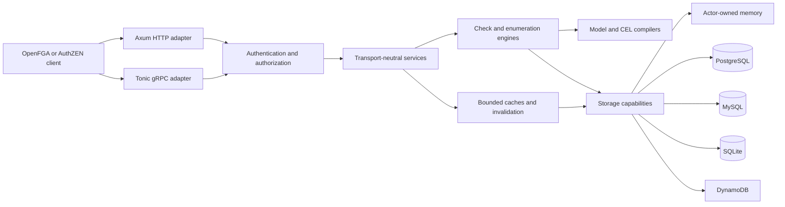

# Architecture

Status: implemented and verified against the source tree on 2026-08-09.

This document is the public architectural map for `openfga-rs`. The specifications under
[`specs/`](../specs/index.md) remain the detailed design contracts; this guide explains how the
running system fits together and where contributors should place changes.

## Design goals

- Match the pinned OpenFGA wire and decision semantics without importing Go implementation state.
- Make invalid domain states unrepresentable after the transport boundary.
- Keep evaluation independent of HTTP, gRPC, SQL, and concrete storage implementations.
- Bound request size, work, concurrency, caches, queues, recursion, and shutdown time.
- Preserve read-after-write and cross-process cache correctness through explicit consistency
  preferences and changelog invalidation.
- Keep project code safe Rust and isolate dependency/native-code risk behind narrow contracts.

The project does not attempt wire compatibility with unspecified future OpenFGA revisions, a
distributed cache-coherence protocol, multi-process SQLite writes, or transparent failover between
writable SQL primaries.

## System context

HTTP and gRPC share one `OpenFgaApi`, so authentication order, validation, authorization, admission,
timeouts, domain conversion, use-case behavior, and public error classification do not drift by
protocol. Health listeners and telemetry are composed by the application rather than semantic
crates.

## Crate boundaries and dependency direction

| Layer | Crates | Owns | Must not own |
| --- | --- | --- | --- |
| Wire | `openfga-proto` | Generated messages, JSON mapping, service descriptors, route metadata | Domain validation, policy, storage |
| Domain | `openfga-domain` | Validated newtypes, commands, limits, fingerprints, cancellation/deadline values | Proto, SQL, HTTP, gRPC |
| Compilation | `openfga-condition`, `openfga-model` | CEL parsing/type checking/evaluation and deterministic model graph/IR | Storage and transport |
| Storage contract | `openfga-storage` | Narrow capabilities, operation context, streams, shared contract suite | Concrete SQL or server policy |
| Storage implementations | `openfga-storage-memory`, `openfga-storage-sql`, `openfga-storage-dynamodb` | Actor state; shared persistence codec; SQL and DynamoDB queries, migrations/schema checks, transactions, cleanup and fault classification | HTTP/gRPC behavior |
| Decision engines | `openfga-check`, `openfga-list` | Check/BatchCheck traversal, set algebra, candidate and residual evaluation | Concrete backends and transport statuses |
| Caching | `openfga-cache` | Model/decision/tuple keys, weights, coalescing, changelog controller | Authentication and HTTP concerns |
| Policy | `openfga-auth` | Disabled/preshared/OIDC authentication and store/action authorization | Business use cases |
| Use cases | `openfga-service` | Store/model/tuple/assertion/check/list/change orchestration | Wire serialization and listeners |
| Adapters | `openfga-transport` | HTTP/gRPC middleware, validation, pagination, conversion, public errors | Concrete backend selection |
| Composition | `apps/openfga-server` | YAML/env configuration, dependency assembly, migrations, telemetry, listeners, shutdown | Reusable semantic rules |

Dependencies point downward through this table. Concrete backends implement storage traits and are
selected only in `openfga-server`. This keeps model and decision tests fast, lets every backend run
the same contract suite, and prevents framework types from leaking into domain APIs.

## Request lifecycle

An ordinary API request follows this sequence:

1. Listener limits bound the body and attach a request ID and redacted tracing context.
2. Authentication establishes a principal before validation can disclose store or request details.
3. Route-level preauthorization rejects actions the principal can never perform.
4. Protobuf/JSON structural validation runs exhaustively and maps failures to pinned public errors.
5. Store/action authorization runs before endpoint admission, preventing unauthorized callers from
   consuming protected work capacity.
6. Global and operation-class admission limits acquire finite permits; request deadlines and
   cancellation enter the domain `OperationContext`.
7. The transport converts validated wire values into private-field domain types.
8. A transport-neutral service coordinates compilation, cache policy, storage, and the selected
   evaluator.
9. The adapter converts the semantic result or classified error back to HTTP/gRPC and records a
   bounded completion class.
10. Dropped clients propagate cancellation; owned child work is joined before request completion.

Successful wire normalization and structural validation can be memoized by an exact, bounded key.
The key includes message type, HTTP route, and raw body because route parameters are injected into
the typed request. Invalid requests are never cached. Messages with time-relative rules bypass
validation memoization, and authorization and business logic always execute.

## Model and decision execution

Authorization models are validated and compiled into immutable IDs, symbol tables, rewrite nodes,
relation metadata, and compiled CEL programs. The compiler enforces type/relation/rewrite/condition
limits before publication. A byte-weighted semantic cache shares identical successful CEL programs
and coalesces concurrent misses; compilation failures are not retained.

Check evaluates the compiled rewrite graph with explicit depth, dispatch, datastore-query,
tuple-item, condition-cost, deadline, and cancellation budgets. Reducers implement union,
intersection, and difference truth/error precedence without leaking task scheduling order into the
result. Identical in-flight Checks can be coalesced behind a bounded key set and a shadow-verification
kill switch.

ListObjects performs bounded reverse candidate discovery and residual Check evaluation. ListUsers
uses bounded set algebra over users, usersets, and typed wildcards. Expand returns the rewrite tree.
All enumeration work has independent candidate, residual, root, result, and concurrency limits.

## Storage and consistency

`openfga-storage` exposes capability-specific traits rather than one broad repository interface.
Every implementation runs shared semantic contracts. Mutating tuple operations atomically write
tuples and changelog entries; model publication persists only a successfully compiled model.

- Memory storage runs as an actor that exclusively owns state and communicates through bounded
  Tokio channels.
- PostgreSQL uses a bounded pool, a global storage-work semaphore, transactional writes, optional
  bounded-lag replicas, and startup/explicit migrations.
- MySQL implements the same capability contracts with backend-specific locking, upsert, and error
  classification.
- SQLite uses exactly one connection and targets embedded, single-process operation.
- DynamoDB uses one regional base table, fixed forward/reverse/change/directory shards, conditional
  transactions, staged immutable chunks, and a supervised durable-generation cleanup actor. It is
  preview-only until the real-AWS graduation evidence is complete.

`HIGHER_CONSISTENCY` bypasses mutable tuple/decision/latest-model aliases and reads authoritative
storage. `MINIMIZE_LATENCY` may use bounded caches only after the per-store changelog controller is
ready. Local writes invalidate synchronously; independent writers converge through changelog
polling. Timeout, lag, backlog, ordering ambiguity, or controller failure disables affected caches
and flushes conservatively rather than serving an unproven result.

## Concurrency and ownership

The runtime uses structured ownership rather than detached background tasks:

- listener supervisors own HTTP, gRPC, health, telemetry, storage, cache-controller, and identifier
  actors;
- endpoint admission, evaluator reads, residual roots, storage work, database pools, actor
  mailboxes, and in-flight coalescing keys all have finite capacities;
- actor state is message-owned instead of wrapped in application-wide mutexes;
- shutdown marks readiness false, stops admission, drains until a configured deadline, signals
  actors, joins owned tasks, flushes telemetry, and closes pools;
- task panics and join failures are classified and surfaced to the supervisor.

Cache readers use immutable shared values. Cache capacity is expressed as conservative owned-byte
weight or a finite entry count; deployment configuration rejects excessive individual and aggregate
budgets.

## Security boundaries

Every value crossing HTTP, gRPC, environment, YAML, token, OIDC, database, migration, or upstream
snapshot boundaries is treated as hostile. Controls include:

- body/string/collection/numeric/depth/work limits and `deny_unknown_fields` where applicable;
- parameterized SQL and validated private-field domain newtypes;
- preshared constant-time comparison, bounded OIDC/JWKS fetches, SSRF controls, and key rotation;
- rustls/AWS-LC TLS, sensitive-header redaction, and structured bounded-cardinality telemetry;
- signed, scope-bound continuation tokens with active/prior key rotation;
- `#![forbid(unsafe_code)]`, dependency advisory/license/source policy, secret scanning, SBOMs,
  checksums, and GitHub build/SBOM attestations.

See the [threat model](security/threat-model.md) for abuse cases, verification, and residual risk.

## Performance architecture

Performance changes must preserve these invariants: finite memory, exact request/model/cache keys,
eager validation, authorization on every action, persistent publication, authoritative-read bypass,
and conservative failure behavior. Optimization is driven by sampled profiles and isolated
component benchmarks before end-to-end comparison.

The current hot-path design uses one immutable protobuf descriptor pool, predecoded validation
rules and regexes, exact successful-wire memoization, compiled immutable models/CEL programs,
bounded decision/model/tuple caches, and coalescing for identical work. Criterion and fixed-budget
benches cover evaluator/cache latency, model load/compile memory, concurrent compilation,
publication, and identifier allocation. The [performance report](research/phase4-scale-benchmark-report.md)
contains complete methodology and limitations.

## Observability and operations

Tracing spans carry bounded identifiers and completion classes; secrets, tokens, query strings, and
condition contexts are not logged. OTLP traces and metrics, readiness/liveness, cache-controller
freshness, admission, evaluator, storage, pool, and shutdown signals are documented in the
[observability runbook](operations/observability-runbook.md). Dashboard and alert artifacts are
validated as part of `make check-docs`.

## Extension checklist

When adding a backend, protocol, evaluator, or cache:

1. Put the implementation at the owning layer and preserve dependency direction.
2. Define boundary validation and finite resource limits before adding concurrency.
3. Reuse semantic contracts and add failure/cancellation/overload cases.
4. State cache identity and invalidation proofs; do not infer coherence from time alone.
5. Update the compatibility matrix, architecture/spec decision, operator runbooks, and threat model.
6. Run the smallest relevant checks during development and the repository-prescribed full gates
   before handoff.

Load-bearing decisions are indexed in the [key-decisions log](../specs/99-key-decisions.md), and the
normative requirements-to-evidence map is in
[verification/normative-requirements.md](verification/normative-requirements.md).
