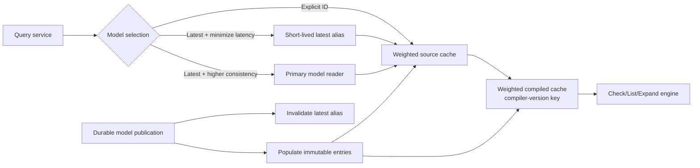
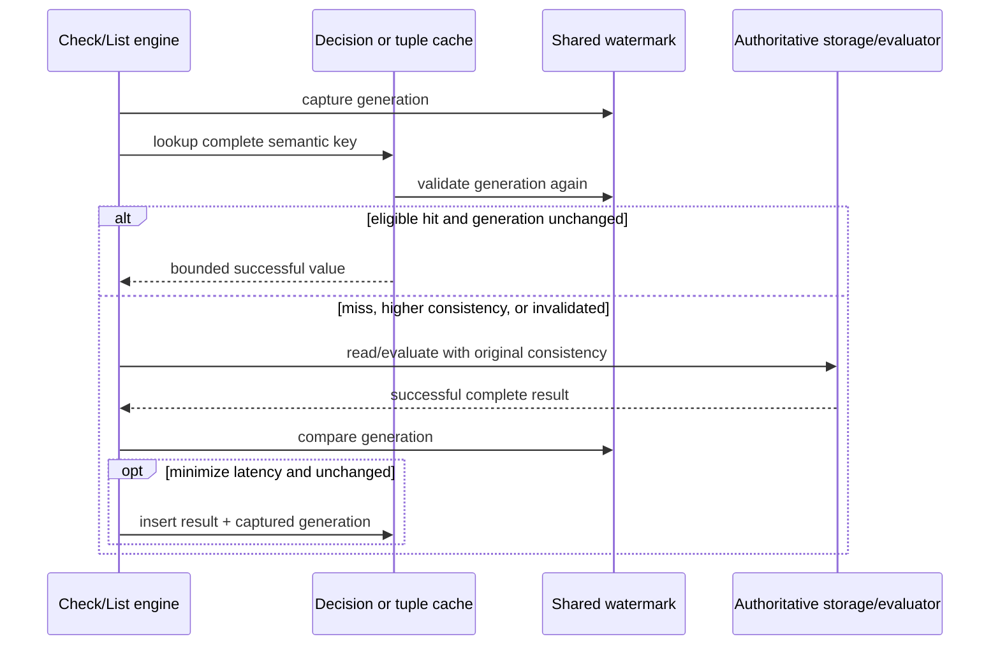
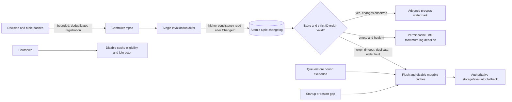

# Cache and consistency design

Status: Proposed · Depends on: [`12-model-compiler-design.md`](12-model-compiler-design.md), [`13-storage-design.md`](13-storage-design.md), [`14-check-engine-design.md`](14-check-engine-design.md)

## Cache taxonomy

Every cache has a project trait, one canonical key/value schema, independent capacity/weight/TTL policy, hit/miss/error metrics, and explicit consistency eligibility.

| Cache | Key | Value | Invalidation |
| --- | --- | --- | --- |
| Model source | `(store, model_id)` | immutable validated source | none before bounded TTL/eviction |
| Compiled model | `(store, model_id, compiler_version)` | `Arc<CompiledModel>` | none before bounded TTL/eviction |
| Latest model alias | `store` | model ID | publication update + short TTL |
| Decision | semantic Check key below | allow/deny + safe metadata | changelog marker/TTL; bypass higher consistency |
| Tuple read | normalized read shape + store revision window | bounded owned tuple batch | changelog marker/TTL; bypass higher consistency |

The decision key includes explicit store/model/fingerprint, canonical object/relation/subject, contextual-tuple canonical fingerprint, condition-context fingerprint, and evaluator semantics version. Secret context is hashed with a process key; raw context is never stored in keys or metrics. A request resolving `Latest` first obtains an explicit model ID.

Cold source loads and compilations are coalesced independently. A failed load or compile is shared with current waiters but never inserted. Local publication populates explicit immutable entries and invalidates, rather than overwrites, the latest alias so concurrent publications cannot regress it. Higher-consistency latest selection bypasses the alias and resolves through the primary before continuing under an explicit immutable ID.

Errors, cancelled work, resource exhaustion, and partial streams are never cached. Negative results follow the same mutation consistency rules as positive results.

## Mutation invalidation

Tuple mutation and changelog append commit atomically. A supervised cache-controller actor consumes each store's ordered changelog, advances a monotonic invalidation watermark, and records conservative store/relation/object markers. Missing events, token expiry, controller lag beyond threshold, or restart gaps flush affected mutable caches rather than risking stale allows.

Initial correctness MAY invalidate all mutable entries for the store. More granular invalidation graduates only with a proof that every impacted direct, computed, TTU, recursive, and list-derived key is covered. Invalidation queues are bounded; overflow triggers conservative flush and a health/metric signal.

The initial watermark is process-global and therefore conservatively invalidates mutable entries for every store after any observed change. This sacrifices some multi-store hit rate but avoids an unproven relation/object scope. Exact, forward, userset, reverse, existence, count, and paged tuple shapes use distinct canonical fingerprints including every filter, bound, and cursor input. Partial streams and every error class remain ineligible.

Registration and tracked-store cardinality share the configured finite controller capacity. A store remains cache-ineligible until its first successful poll, and each successful poll grants eligibility only through an absolute maximum-lag deadline. This deadline is checked on the request path, so a blocked controller cannot extend the stale window. Changelog identifiers are ordered but not consecutive, so an absent identifier cannot be inferred from ULID arithmetic; detectable store/order/cursor faults flush, while TTL and the maximum-lag deadline cover retention or otherwise unobservable gaps.

## Consistency behavior

- `HigherConsistency`: read mutable tuples from primary, bypass decision and tuple-read caches, and do not populate them from that request.
- `MinimizeLatency`: may use eligible caches/replicas. An entry is usable only when its creation watermark is not older than the controller's invalidation marker for all relevant scopes.
- Immutable explicit models may be cached under either preference. Latest alias policy cannot change the meaning of a request after it resolves to an explicit ID.

Cache unavailability is fail-open to the authoritative datastore/evaluator, never fail-open to authorization. Cache-controller uncertainty disables affected caches.

## Lifecycle and capacity

Moka caches use explicit maximum weight and TTL; weights approximate owned bytes, not just entry count. Controllers are supervised tasks with start/readiness/stop/restart states, bounded `mpsc` channels, deadlines on changelog reads, exponential backoff with jitter, and graceful join. Configuration changes create validated replacement policy; no caller's first insertion chooses shared policy.

## Acceptance criteria

- Key mutation tests prove every semantic input changes the decision identity.
- Concurrent write/check tests never serve pre-write decisions under higher consistency.
- Dropped/duplicated/out-of-order changelog simulations either converge safely or flush; none produce a stale allow after the documented window.
- Cache failures preserve correct authoritative results.
- Capacity, TTL, redaction, actor restart, shutdown, and stampede/coalescing behavior have deterministic tests.

## Engineering norms

All repository `AGENTS.md` engineering sections bind cache/controller code. Actors own mutable invalidation state and use bounded channels with start/stop/restart; `ArcSwap` is limited to measured immutable snapshots; failures use typed errors and fail back to authoritative evaluation; keys and telemetry redact contexts; capacity arithmetic is checked; public cache policy/lifecycle APIs are documented and fault tested. Serialization applies only to canonical key fingerprints/watermarks, not third-party cache objects.

## Cross-references

- ← Depends on: [`12-model-compiler-design.md`](12-model-compiler-design.md), [`13-storage-design.md`](13-storage-design.md), [`14-check-engine-design.md`](14-check-engine-design.md)
- → Consumed by: [`21-runtime-operations-design.md`](21-runtime-operations-design.md)
- ↔ Research: [`../docs/research/study-openfga-implementation.md`](../docs/research/study-openfga-implementation.md), [`../docs/research/survey-rust-ecosystem.md`](../docs/research/survey-rust-ecosystem.md)
- ↔ Prior art: cache identity/policy in `vendors/openfga/docs/caching.md:30` and changelog controller behavior in `vendors/openfga/internal/cachecontroller/cache_controller.go:143`
