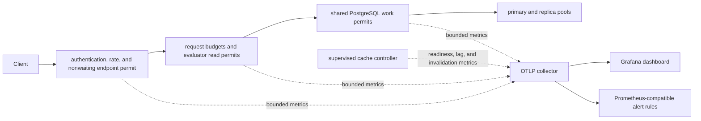

# Runtime and operations design

Status: Proposed · Depends on: [`13-storage-design.md`](13-storage-design.md), [`16-cache-consistency-design.md`](16-cache-consistency-design.md), [`20-api-transport-design.md`](20-api-transport-design.md)

## Process composition

`openfga-server` is the application boundary. It validates configuration, installs the rustls `aws-lc-rs` provider, creates telemetry, storage pools, model/tuple/cache services, authentication/authorization policy, and transport listeners, then supervises background actors. Library crates return typed errors; application assembly adds `anyhow::Context` and may terminate on unrecoverable startup invariants.

No service is retrieved from task-local context. Explicit constructor dependencies use `typed-builder` when a structure exceeds five fields. `Debug` redacts secrets. Every project crate forbids unsafe code and enables the repository lint policy.

## Configuration

Canonical configuration is YAML, deserialized with unknown-field denial and overridden by documented environment variables. It includes listeners/TLS, storage backend/DSNs/pools, migrations, auth mode, access-control store, endpoint limits/timeouts, evaluator budgets/semaphores, caches, telemetry, and shutdown deadlines.

The DynamoDB section adds validated table name, Region, bounded request/attempt timeouts, SDK/conflict retry counts, in-flight capacity, a `1..=49` tuple-mutation limit, garbage-collection interval/batch/concurrency/retention bounds, and an optional development endpoint. Credentials remain in the AWS workload-identity/default provider chain and are not YAML fields. A custom endpoint is rejected outside explicit loopback development mode. The runtime selects `openfga-storage-dynamodb` and supervises its cleanup lifecycle without exposing AWS types above application assembly; see [`17-dynamodb-storage-design.md` § 2](17-dynamodb-storage-design.md#2-crate-and-interface).

Validation converts raw config to domain config with positive/ranged types. Relationships are checked: database concurrency cannot exceed pool policy; queue and cache byte ceilings fit process limits; public listener requires TLS according to production profile; disabled auth requires every listener to be loopback and explicit development mode. Secrets load from environment/file-descriptor/secret-provider references, never from committed YAML. Runtime-tunable values may be published through validated `ArcSwap` snapshots; immutable startup fields reject reload.

`openfga-server validate-config` performs validation without network/storage mutation. `print-effective-config` redacts all secrets. Automation is exposed through Makefile targets, not ad hoc project shell scripts.

## Lifecycle

Startup sequence: configuration → telemetry → crypto → storage connection/schema check → caches/controllers → auth/JWKS readiness → services → listeners → ready. Readiness remains false until required dependencies and actor watermarks are valid.

Shutdown sequence: mark unready → stop admission → allow bounded request drain → cancel streams/evaluators → stop and join cache/JWKS actors → flush telemetry → close pools/listeners. Every spawned task is owned by a supervisor/`JoinSet`; panic becomes a health event and follows a documented restart policy. Repeated failure of a correctness-critical actor disables its feature or readiness, never silently continues stale.

## Migrations and commands

The binary provides noninteractive `migrate up`, `migrate status`, and schema compatibility checks. Migration uses an advisory/process/conditional datastore lease, verifies checksums, reports current/target versions, and never auto-downgrades. Automatic startup migration is opt-in and unsuitable for multi-replica production unless the lock is supported. DynamoDB provisioning uses a separate control-plane role, creates or advances only the exact configured table, and never silently changes billing/KMS/PITR/deletion-protection policy during normal startup. Backup/restore and upstream-schema migration procedures are documented and tested before GA.

## Telemetry

Use `tracing` and OpenTelemetry. Logs are structured JSON in production and human-readable in development. Spans connect transport, model resolution, evaluator, condition, and storage calls. Metrics include request/result latency, in-flight/overload, evaluator dispatch/read/item/budget, cache hit/lag/flush, SQL pool wait or DynamoDB request permits/consumed capacity/throttles/HEAD conflicts, actor restarts, migration/schema, and auth/JWKS health.

Labels use endpoint, result/error class, strategy, backend, and object/subject type only when cardinality is bounded. Object IDs, subject IDs, tuples, contexts, tokens, credentials, DSNs, and SQL parameter values are forbidden. Redaction tests inspect logs/errors/debug output.

PostgreSQL-backed configurations validate endpoint and nested evaluator concurrency against pool
capacity. The storage work semaphore remains the final finite queue; per-request evaluator budgets
leave headroom within a pool-sized scheduling wave for control-plane work. Dashboard and alert
artifacts are versioned with the server, validated by the documentation gate, and paired with
capacity and incident runbooks.

## Health and resilience

Liveness reports event-loop/process health without touching external systems. Readiness reports storage/schema, authentication key availability, and correctness-critical actor state with bounded cached probes. Each network/disk operation has a timeout. Retries are bounded, jittered, idempotency-aware, and never retry semantic validation or non-idempotent mutation after ambiguous commit without reconciliation.

## Acceptance criteria

- Startup rejects invalid/insecure configuration before binding a public listener.
- SIGTERM and client disconnect integration tests prove ordered drain and no leaked tasks/connections.
- Actor panic/restart, storage outage, JWKS outage, telemetry outage, and cache lag have explicit fail-safe behavior.
- Effective configuration and every diagnostic surface pass secret-redaction tests.
- Migration tests cover fresh, upgrade, checksum mismatch, concurrent invocation, too-new schema, and interrupted failure.

## Engineering norms

All repository `AGENTS.md` engineering sections bind the application. Tokio features are explicit; actors/tasks have start/stop/restart and panic handling; YAML configuration is validated into specific types; application errors use `anyhow` context while library sources remain typed; rustls/aws-lc and secret types follow security policy; tracing is structured/redacted; blocking work uses `spawn_blocking`; public CLI/config behavior is documented and end-to-end tested.

## Cross-references

- ← Depends on: [`13-storage-design.md`](13-storage-design.md), [`16-cache-consistency-design.md`](16-cache-consistency-design.md), [`20-api-transport-design.md`](20-api-transport-design.md)
- → Consumed by: release milestones in [`90-delivery-roadmap.md`](90-delivery-roadmap.md)
- ↔ Research: [`../docs/research/survey-rust-ecosystem.md`](../docs/research/survey-rust-ecosystem.md)
- ↔ DynamoDB backend: [`17-dynamodb-storage-design.md`](17-dynamodb-storage-design.md)
- ↔ Prior art: server lifecycle/options in `vendors/openfga/pkg/server/server.go:326` and backend architecture in `vendors/openfga/docs/architecture/architecture.md:3`
